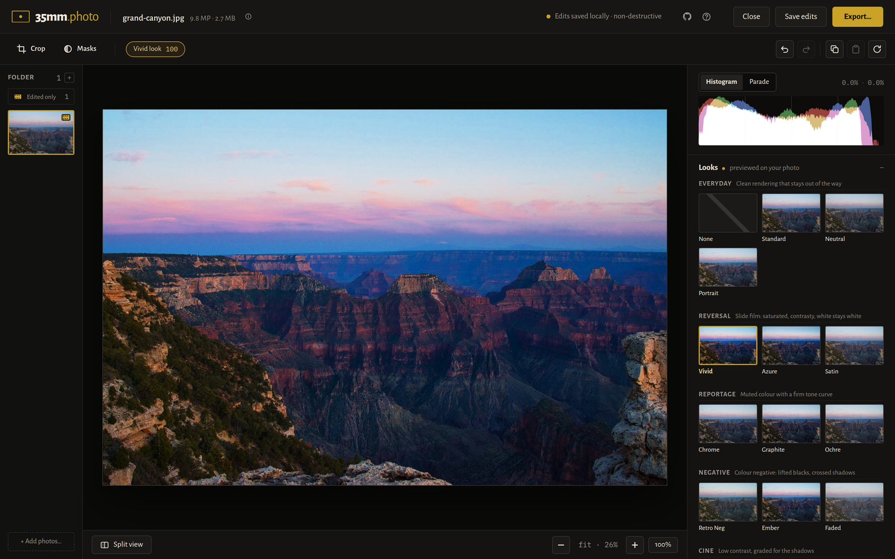
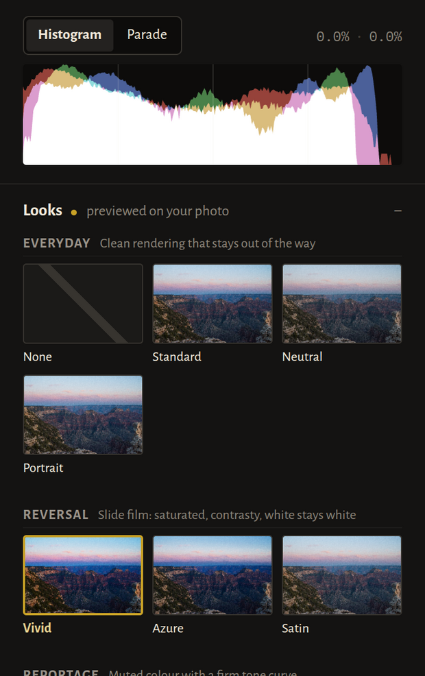
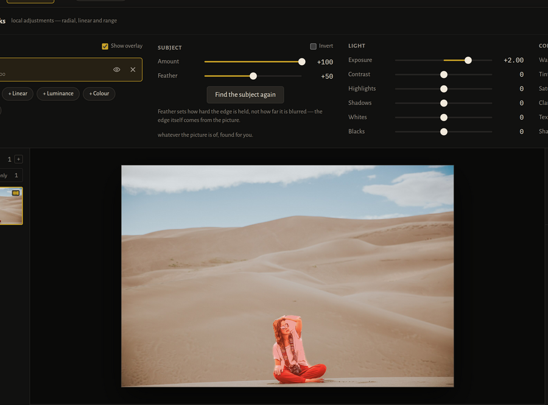
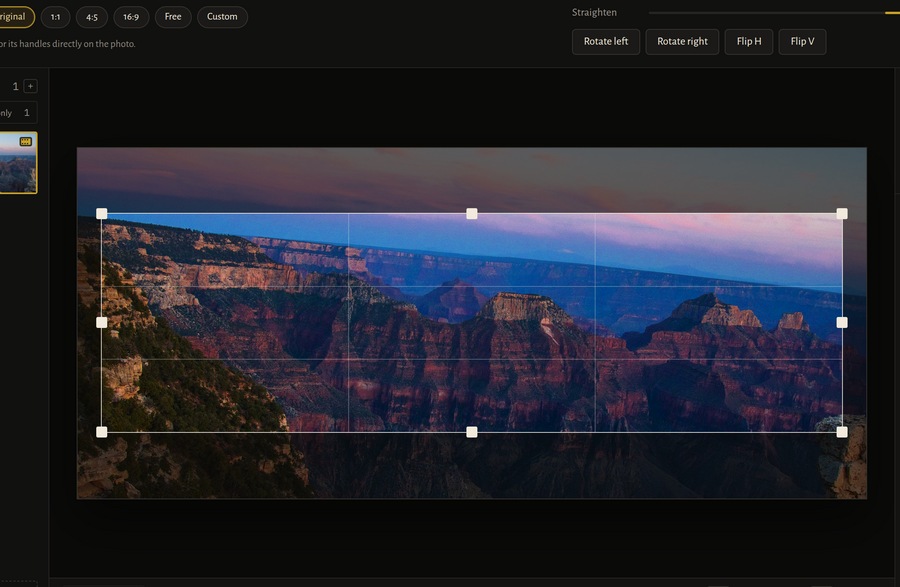

<p align="center">
  
</p>

<p align="center">
  A full-featured photo editor that runs entirely in your browser.<br>
  <a href="https://35mm.photo"><strong>35mm.photo</strong></a>
</p>

<p align="center">
  
</p>

---

35mm develops camera raw, grades colour on the GPU and exports — all inside the
browser tab. There is no backend and no account. Editing is non-destructive: the
pipeline is parametric end to end, so every adjustment stays adjustable and the
original file is never rewritten unless you export.

## A few of the things it does

### Thirty-two looks, previewed on your own photograph

Not a filmstrip of somebody else's sample. Every look in the grid is rendered
from the photo that is open, through the same pipeline that will export it, so
what you pick is what you get. They are original colour transforms synthesised
from a hue-band description rather than baked cubes — see
[Looks](#looks-and-presets) below.

<p align="center">
  
</p>

### Mask the subject, found for you

A salient-object model runs in a worker, entirely on your machine, and a guided
filter re-cuts its answer along the edges the photograph already has. What gets
stored is the *intent* — find the subject — and never the pixels, so a subject
mask travels through a sidecar and a batch sync like every other mask, and
finds each photo's own subject rather than inheriting somebody else's outline.
The map it finds is cached in the browser the way a developed raw is, so
closing the photo and coming back brings the mask back without the model
running again.

<p align="center">
  
</p>

### Crop and straighten that stay anchored

Masks are stored in upright image coordinates, before the crop and the quarter
turns — so re-crop or straighten afterwards and every adjustment stays on the
thing it was placed over.

<p align="center">
  
</p>

## Features

- **Camera raw development** via [LibRaw](https://www.libraw.org/) compiled to
  WebAssembly — demosaic, camera white balance, 16-bit pipeline, with the
  develop settings a photographer should have a say in: white balance basis,
  demosaic quality, highlight reconstruction, pre-demosaic noise reduction and
  a half-size draft mode
- **Light and colour** — exposure, contrast, highlights, shadows, whites,
  blacks, white balance, vibrance, saturation, and a **dynamic range** control
  that reads the area around each pixel rather than the pixel alone, so a
  subject in shadow can open without the sky behind it opening too
- **Tone curves**, RGB and per-channel
- **Colour mixer** — hue, saturation and luminance across eight bands
- **Colour grading** — split toning across shadows, midtones and highlights
- **Masks and local adjustments** — radial, linear, luminance or colour range,
  and **subject**, found by a salient-object model that runs on your own
  machine; each carries its own tone, colour and detail
- **Detail** — texture, clarity, dehaze, sharpening, luminance and chroma
  noise reduction
- **Looks** — thirty-two built-ins across seven groups — everyday, reversal,
  reportage, negative, cine, monochrome and exotic — plus your own imported
  LUTs and presets
- **Crop and straighten**, with aspect presets and rotation
- **Perspective and optics** — keystone correction, plus manual distortion and
  chromatic aberration
- **Halation, grain and vignette**
- **Live histogram and RGB parade**
- **Batch editing** — select many photos, sync settings by group, export a
  whole selection into one folder
- **Installs as a PWA** and works offline, including raw development and HEIC

## Formats

| | |
| --- | --- |
| **Photos** | JPEG, PNG, HEIC/HEIF, WEBP, AVIF, GIF, BMP |
| **Camera raw** | RAF, RW2, CR2, CR3, CRW, NEF, ARW, SR2, DNG, ORF, PEF, SRW, MRW, ERF, DCR, 3FR, MOS and others LibRaw supports |
| **Looks** | `.cube`, HALD and tiled LUT images |
| **Presets** | `.xmp` and `.lrtemplate` from Lightroom Classic / Camera Raw |
| **Camera profiles** | `.dcp` — the hue/saturation warps and tone curve are baked into a look |

HEIC is the iPhone's default, and the one format on that list most browsers
cannot decode: Chrome, Edge and Firefox all declined to ship a decoder for it,
the format resting on HEVC. So 35mm carries one — [libheif](https://github.com/strukturag/libheif)
compiled to WebAssembly, fetched the first time you open a HEIC on a browser
that needs it and cached from then on. Safari and iOS decode HEIC themselves,
and never download it at all.

<a id="looks-and-presets"></a>

The built-in looks are original colour transforms, synthesised in the app from
a hue-band description rather than shipped as baked cubes. The exotic ones are
derived from what the process physically did — infrared film renders foliage
red because chlorophyll reflects infrared, and white in black and white for the
same reason; cross-processing crosses because three layers land on curves meant
for a different film. Those claims are checkable, so they are checked: a test
asserts that foliage comes out magenta, that a red subject comes out yellow,
and that solarisation actually reverses. They are named for
what they do — the colour, the material, the process. None of them is derived
from, named after, or claims any compatibility with a camera maker's own picture
modes; where one lands somewhere familiar, that is the same physics described
twice.

A Lightroom preset imports as slider values rather than a baked cube, so
everything it sets stays editable afterwards. Whatever it uses that this
pipeline has no equivalent for — camera profiles, texture, dehaze, lens and
perspective corrections, and Lightroom's own masks — is reported on import
rather than dropped in silence. 35mm has masks of its own, but not Lightroom's
model of them: theirs carries AI subject and sky selections, mask groups and
intersections, none of which a handful of numbers can stand in for.

GPR, X3F and plain RGB TIFF are not supported. They fail with a message saying
so rather than appearing to work.

## Running it

```sh
npm install
npm run dev        # http://localhost:5173
npm run build      # static bundle in dist/
npm run preview    # serve the built bundle
npm test           # unit tests
```

`npm run build` type-checks first, so a build failure is a real failure. Tests
cover the CPU side of the pipeline — the geometry matrices, the camera-profile
parser and the LUT it bakes — and run in CI before a deploy. The GPU passes are
checked by driving the real app in a browser instead; a shader is not something
a unit test can meaningfully assert about.

## Keyboard

| | |
|---|---|
| `⌘Z` / `⌘⇧Z` | undo / redo |
| `⌘O` | open photos |
| `⌘E` | export |
| `⌘C` / `⌘V` | copy / paste look |
| `\` | before/after split |
| `C` | crop |
| `M` | masks |
| `F` / `1` | fit / 100% |
| `←` `→` | previous / next photo |
| `[` `]` | cycle looks |

Sliders reset on double-click or alt-click. Zoom is `ctrl`/`cmd` + scroll, or
pinch; drag to pan.

## How it is put together

```
src/
  app/          shell, layout, viewport, dialogs
  editor/
    gpu/        WebGL2 context, render graph, transforms, white balance
    shaders/    GLSL ES 3.00 passes, one file per stage
    tools/      the adjustment panels
    presets/    look catalogue, 3D LUT synthesis, curves, preset import
    edit-stack/ edit state, history, derived edit summary
  raw/          LibRaw development and the preview conversion worker
  io/           file pickers, decode, export, sidecars
  storage/      IndexedDB persistence
  pwa/          service worker registration
public/
  luts/         drop-in .cube files (see its README)
  sw.js         offline shell
  precache.json written by the build; what to cache and what to warm
brand/          brand sources and the social card's render step
```

Edit state is a single plain-JSON object. Nothing is baked into pixels until
export, so undo, the before/after split and the `.35mm.json` sidecar all fall
out of the same parametric state. Rendering is one WebGL2 graph — geometry,
colour, local, detail and finishing passes, with looks applied as a 3D LUT.

Masks are part of that state rather than an exception to it: a shape or a range
is a few numbers, so local adjustments round-trip through a sidecar like
everything else. They are stored in upright image coordinates — the picture the
right way up, before the crop — which is what lets a mask stay on the thing it
was placed over when the crop, the straighten or the quarter turns change
underneath it.

## Offline

The build writes `precache.json` describing what it produced, split four ways:
the shell, LibRaw, libheif and the subject detector. The service worker
precaches the shell at install, so the app opens with no network after one
visit rather than two — before, its own JS and CSS were only cached on the
*second* load, because the worker takes control after the first one has already
fetched them.

The two file decoders are then warmed in the background once the app has
settled, which is what makes a raw or a HEIC openable offline at all: nothing
else ever fetched them, so a lazily-loaded decoder was simply absent without a
network. Save-Data and 2g connections are left alone.

The subject detector is deliberately not prefetched. It is about seventeen
megabytes, the Masks panel asks before the first detection, and spending that
quietly would go behind the back of a question the app already knows to ask.
Once it has been fetched it is kept.

Two caches, not one: the shell is keyed by a build id stamped into `sw.js`, so
each deploy replaces it, while everything fingerprinted lives in a long-lived
cache that survives deploys. Without that split, shipping a release would cost
every user the detector again.

Raw decoding and histogram binning run in workers. The LibRaw binary is 1.4 MB
and sits behind a dynamic import, so it is fetched only when you open a raw
file. Because that work is off the main thread, the progress indicator sits in
a corner of the frame and takes nothing away while it runs — the photo you were
looking at stays on screen and every control stays live.

Develop settings live on the edit stack like everything else, so they reach the
sidecar, sync and undo. Unlike everything else they cannot be applied to pixels
that already exist, so any write that moves them runs the decoder again.

A developed raw is cached at preview resolution, keyed by the file *and* the
develop settings, which turns re-opening a 50 MP frame from 4.4 s into about
0.3 s. It is stored as PNG: lossless WebP takes 2.4 s to encode, and lossy WebP
moves pixels by up to 60 levels, which is not something to put under a
photograph someone is grading. The cache holds previews only — an export always
develops from the raw, so nothing that leaves the app has been through it.

## Deploying

`.github/workflows/deploy.yml` builds and publishes `dist/` to GitHub Pages on
every push to `main`. The site is served from an apex domain, so `base` defaults
to `/`; build with `BASE_PATH=/35mm/ npm run build` to publish under a subpath.

The custom domain is set in the repo's Pages settings, not by `public/CNAME` — a
Pages deploy from Actions ignores a `CNAME` file in the uploaded artifact.

The published site loads Google Analytics, injected at build time only when
`GA_MEASUREMENT_ID` is set. A local build has no analytics at all, and nothing
about a photo is sent anywhere.

## Not implemented

A WebGPU backend — capability detection exists, but WebGL2 is the only
implemented one.

There is no brush. A painted mask is a bitmap, and a bitmap is the one thing
this edit state cannot carry as a few numbers in a sidecar — the subject mask
sidesteps that by storing the intent and deriving the coverage, which a brush
stroke cannot do, since its pixels *are* the intent. Vector strokes would fit,
and are not built. Eight masks per photo is the ceiling, because every pass that
reads them evaluates every one of them per pixel, and four of those may be
subject masks, which share one texture's worth of channels.

Batch export needs the File System Access API to write a folder; browsers
without it fall back to exporting one photo at a time.

Lens correction is manual only. Profile-driven correction needs Adobe's lens
profile database, which cannot be shipped with a web app, so a preset that
relies on one says so on import rather than pretending. Camera profiles are
applied as a look rather than colorimetrically: raw development has already
mapped the sensor to sRGB by the time the profile is reached, so its hue,
saturation and tone rendering carry over but its absolute colour does not.

## Licence

35mm is [MIT licensed](LICENSE). The photographs in the screenshots are CC0 and
credited in [docs/CREDITS.md](docs/CREDITS.md).

It ships two LGPL decoders compiled to WebAssembly — [LibRaw](https://www.libraw.org/)
for camera raw, and [libheif](https://github.com/strukturag/libheif) with libde265
for HEIC. Using them does not make 35mm itself LGPL, but it carries conditions that
[THIRD-PARTY-NOTICES.md](THIRD-PARTY-NOTICES.md) sets out in full, along with every
other component that reaches the browser.

The libheif build here is decode-only and deliberately carries no HEVC encoder;
the notices explain why that line matters.
