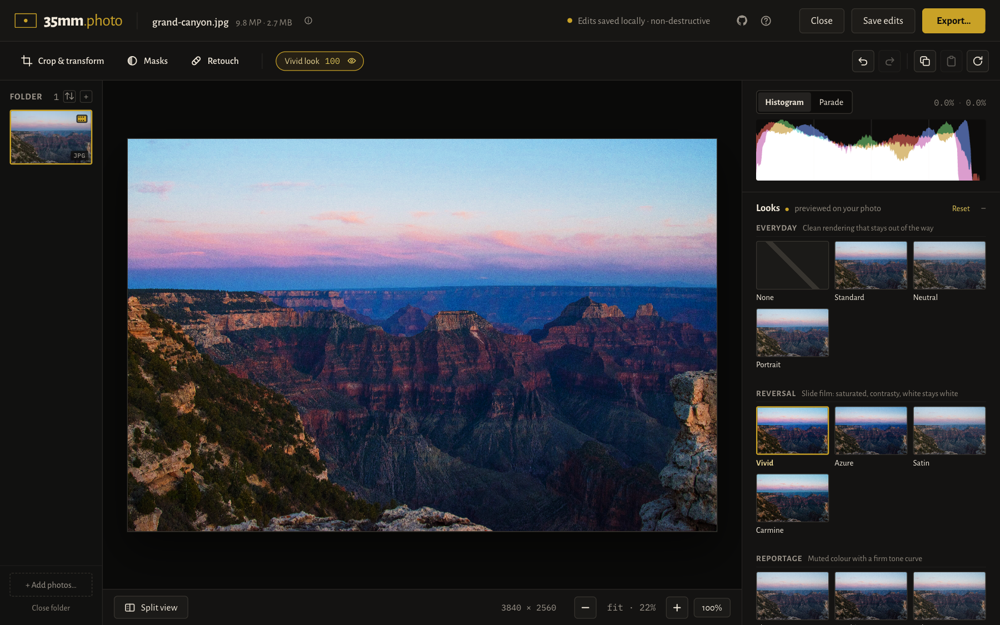
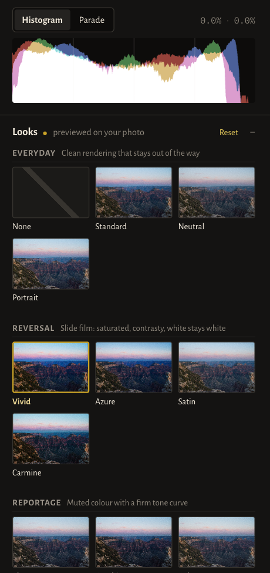
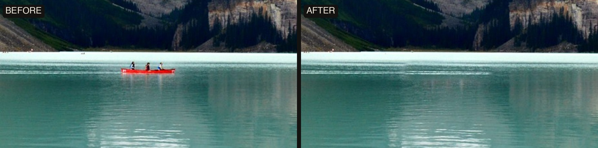
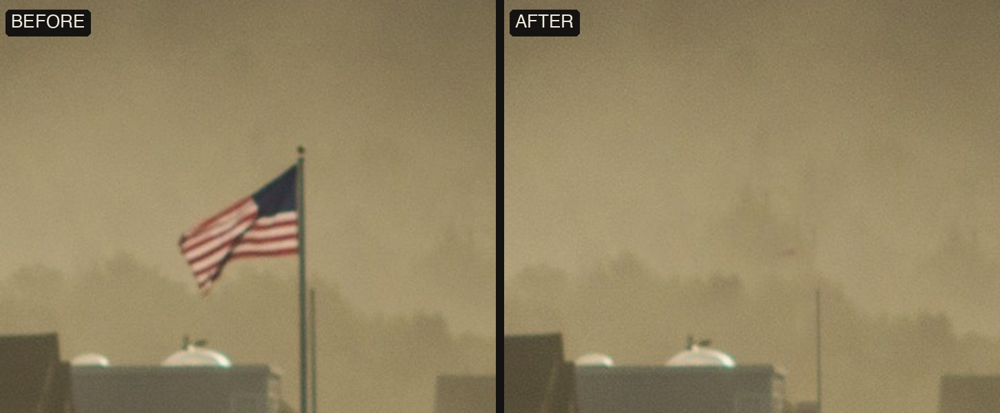
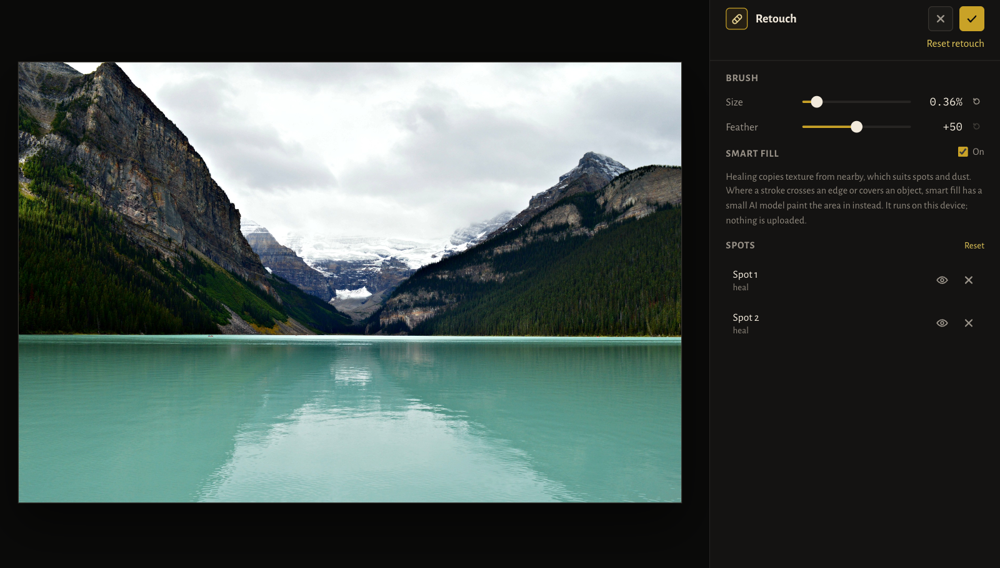
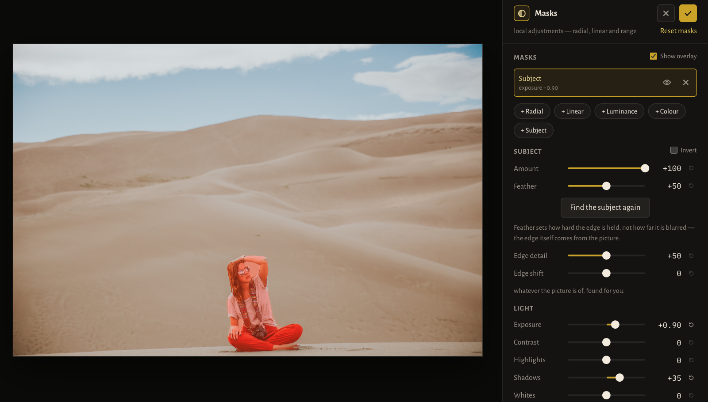
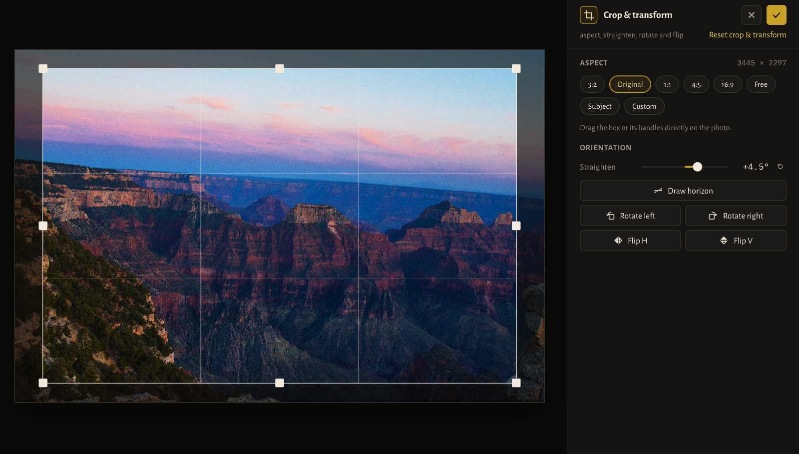

<p align="center">
  
</p>

<p align="center">
  <strong>A real photo editor that runs entirely in your browser.</strong><br>
  Camera raw, film looks, AI masks and a healing brush — no upload, no account, no install.
</p>

<p align="center">
  <a href="https://35mm.photo"><strong>Open 35mm.photo →</strong></a>
  &nbsp;·&nbsp;
  <a href="#run-it-yourself">Run it yourself</a>
  &nbsp;·&nbsp;
  <a href="LICENSE">MIT licensed</a>
</p>

<p align="center">
  
</p>

---

Drop a photo on the page and start editing. 35mm develops camera raw files,
grades colour on your GPU, finds the subject of the picture with an AI model,
heals away spots and distractions, and exports a finished file — and every bit
of that happens inside the browser tab.

- **Your photos never leave your machine.** There is no server to send them to.
  Decoding, rendering, the AI models and the export all run locally.
- **Nothing to sign up for.** Open the page and it works. Install it as an app
  and it works offline too — raw files and HEIC included.
- **Non-destructive, end to end.** Every edit is a setting, not a baked pixel,
  so everything stays adjustable, undo goes all the way back, and your original
  file is never touched.
- **Free and open source.** MIT licensed, top to bottom.

If that is the editor you have been wishing existed, a ⭐ helps other people
find it.

## Highlights

### Thirty-two looks, previewed on *your* photo

Not a strip of somebody else's sample image. Every look in the grid is rendered
from the photo you have open, through the same pipeline that will export it,
so what you pick is what you get. Slide film, reportage, colour negative, cine,
monochrome — and an exotic shelf of infrared, cross-processing and solarisation,
each built from what the process physically did. Bring your own `.cube` LUTs
and Lightroom presets too.

<p align="center">
  
</p>

### Heal it away — with a brush that knows when to ask the AI

Brush over a spot, a speck of sensor dust, a stray hair — or a canoe you did not
want in your lake. 35mm finds a nearby patch that matches, copies its texture
and takes the tone from around the spot, so nothing shows a seam.

<p align="center">
  
</p>

Every heal is scored for whether it will hold. When a stroke crosses an edge or
covers something a copy would smear, **smart fill** hands it to
[MI-GAN](#on-device-ai), a small inpainting model that paints the area in —
running on your own machine, like everything else. Each spot is listed, can be
switched off or deleted, and flipped between heal and fill by hand.

<p align="center">
  
</p>

<p align="center">
  
</p>

### Mask the subject in one click

An AI model finds what the photograph is of, and a guided filter re-cuts its
answer along the edges the picture already has — hair and all. Brighten the
person, cool the background, blur what is behind them. Radial, linear,
luminance and colour-range masks are there too, each with its own light, colour
and detail controls.

<p align="center">
  
</p>

### Crop and straighten that stay anchored

Draw the horizon to level a photo, lock an aspect, rotate and flip — and fix
converging verticals in Optics. Masks and retouch spots are pinned to the picture itself,
not the frame, so re-cropping afterwards never knocks them off what they were
placed on.

<p align="center">
  
</p>

### Camera raw, developed in the browser

[LibRaw](https://www.libraw.org/), compiled to WebAssembly, develops RAF, CR3,
NEF, ARW, DNG and dozens more with a 16-bit pipeline — with the develop
settings a photographer should have a say in: white balance basis, demosaic
quality, highlight reconstruction and pre-demosaic noise reduction. Lenses are
corrected from the [Lensfun](https://lensfun.github.io/) database, matched to
the camera and lens in the file.

<a id="on-device-ai"></a>

## On-device AI

Two small models ship with 35mm. Both run in a Web Worker on
[ONNX Runtime Web](https://onnxruntime.ai/), on your CPU, with nothing uploaded
anywhere. In a browser tab neither is downloaded until you ask for the feature
that uses it; an installed app fetches smart fill on its own. Once fetched,
both are kept, so they work offline.

| | Subject masks | Smart fill |
| --- | --- | --- |
| **Model** | [U²-Netp](https://github.com/xuebinqin/U-2-Net) — salient object detection | [MI-GAN](https://github.com/Picsart-AI-Research/MI-GAN) — image inpainting (ICCV 2023) |
| **What it does** | Finds the subject of the photo; a guided filter then refines the edge against the full-resolution picture | Paints in what a heal cannot, on a 512×512 window around the stroke |
| **Size** | 2.3 MB | 14.2 MB |
| **Precision** | float16, converted from the float32 release | float16 weights, float32 arithmetic — within one level of the original |
| **Licence** | Apache-2.0 | MIT |

Both were picked for being small enough to ship to a browser and licensed
openly enough to ship at all. Details, conversions and the reasons behind them
are in [public/models/README.md](public/models/README.md).

## Everything else it does

- **Light and colour** — exposure, contrast, highlights, shadows, whites,
  blacks, white balance, vibrance, saturation, and a **dynamic range** control
  that reads the area around each pixel, so a face in shadow can open without
  the sky behind it opening too
- **Tone curves**, RGB and per channel
- **Colour mixer** — hue, saturation and luminance across eight bands
- **Colour grading** — shadows, midtones, highlights and a global wheel
- **Detail** — texture, clarity, dehaze, sharpening, luminance and chroma noise
  reduction
- **Optics** — Lensfun profiles for distortion, fringing and vignetting, plus
  keystone correction and manual distortion and chromatic aberration
- **Halation, grain and vignette**, tuned to feel like film
- **Frames** — a mat around the picture, in percent or exact pixels
- **Live histogram and RGB parade**, with clipping readouts
- **Before/after split**, and an eye on every applied edit to switch it off
  without losing it
- **Batch editing** — open a folder, sync settings by group across a selection,
  export the lot into one folder
- **Sidecars** — edits save as `.35mm.json` next to your photos, so they travel
  with the files
- **Installs as an app** and works offline, including raw development, HEIC
  and — once loaded — both AI models

## Formats

| | |
| --- | --- |
| **Photos** | JPEG, PNG, HEIC/HEIF, WEBP, AVIF, GIF, BMP |
| **Camera raw** | RAF, RW2, CR2, CR3, CRW, NEF, ARW, SR2, DNG, ORF, PEF, SRW, MRW, ERF, DCR, 3FR, MOS and the rest of what LibRaw supports |
| **Looks** | `.cube`, HALD and tiled LUT images |
| **Presets** | `.xmp` and `.lrtemplate` from Lightroom Classic / Camera Raw |
| **Camera profiles** | `.dcp` — hue/saturation warps and tone curve, baked into a look |
| **Export** | JPEG, PNG and WebP, at full size or any long edge, with the camera's EXIF carried across |

HEIC is the iPhone's default and the one format most browsers cannot open, so
35mm carries its own decoder — [libheif](https://github.com/strukturag/libheif)
in WebAssembly — fetched only on a browser that needs it.

## Keyboard

| | |
|---|---|
| `⌘Z` / `⌘⇧Z` | undo / redo |
| `⌘O` | open photos |
| `⌘E` | export |
| `⌘C` / `⌘V` | copy / paste settings |
| `\` | before/after split |
| `C` | crop |
| `M` | masks |
| `Q` | retouch |
| `[` `]` | cycle looks — or brush size, in retouch |
| `Delete` | remove the selected spot, in retouch |
| `F` / `1` | fit / 100% |
| `←` `→` | previous / next photo |

Sliders reset on double-click or alt-click, and their numbers can be typed.
Zoom with `ctrl`/`cmd` + scroll or a pinch; drag to pan.

<a id="run-it-yourself"></a>

## Run it yourself

```sh
npm install
npm run dev        # http://localhost:5173
npm run build      # static bundle in dist/
npm run preview    # serve the built bundle
npm test           # unit tests
```

It is a static site — `dist/` can be served from anywhere. The build
type-checks first, and refuses to finish if a model or decoder would end up
precached for every visitor. Tests cover the CPU side of the pipeline — the
geometry, the heal, the parsers and the LUT synthesis; the GPU passes are
checked by driving the real app in a browser.

`.github/workflows/deploy.yml` publishes to GitHub Pages on every push to
`main`. Build with `BASE_PATH=/35mm/ npm run build` to serve from a subpath.

## How it is put together

```
src/
  app/          shell, layout, viewport, overlays, dialogs
  editor/
    gpu/        WebGL2 context, render graph, transforms
    shaders/    GLSL ES 3.00 passes, one file per stage
    tools/      the adjustment panels
    presets/    look catalogue, 3D LUT synthesis, curves, preset import
    edit-stack/ edit state, history, sync, the applied-edits summary
  retouch/      the heal, the fill worker, and the geometry that pins strokes
  subject/      the subject detector and its edge refinement
  lens/         Lensfun matching and correction
  raw/          LibRaw development
  io/           file pickers, decoding, export, sidecars, EXIF
  pwa/          service worker registration and prefetch
public/
  models/       the two ONNX models, and how they were converted
  lensdb/       the Lensfun database, as JSON
```

The whole edit is one plain-JSON object, and nothing is baked into pixels until
export. That one decision is why undo, the before/after split, sidecars and
batch sync all fall out of the same state — and why even the AI features store
an *intent* ("find the subject", "heal this stroke") and derive the pixels,
rather than stuffing bitmaps into your edits. Rendering is a single WebGL2
graph: retouch, lens and geometry, colour, local adjustments, detail and
finishing, with looks applied as a 3D LUT.

Offline works in layers. The app shell is precached on the first visit. The raw
and HEIC decoders are warmed in the background once the app settles. The AI
models are fetched only when you ask for them — or, in an installed app,
shortly after it first starts — and kept across releases.

## Licence and credits

35mm is [MIT licensed](LICENSE).

It stands on a lot of generous work: [LibRaw](https://www.libraw.org/) and
[libheif](https://github.com/strukturag/libheif) (both LGPL, compiled to
WebAssembly), [ONNX Runtime Web](https://onnxruntime.ai/),
[U²-Net](https://github.com/xuebinqin/U-2-Net),
[MI-GAN](https://github.com/Picsart-AI-Research/MI-GAN) and the
[Lensfun](https://lensfun.github.io/) database. The conditions that come with
each are set out in full in [THIRD-PARTY-NOTICES.md](THIRD-PARTY-NOTICES.md).

The photographs in the screenshots are CC0, from Unsplash via Wikimedia
Commons, and credited in [docs/CREDITS.md](docs/CREDITS.md).

<p align="center">
  <a href="https://35mm.photo"><strong>Try it now at 35mm.photo</strong></a> — and if you like it, ⭐ the repo.
</p>
